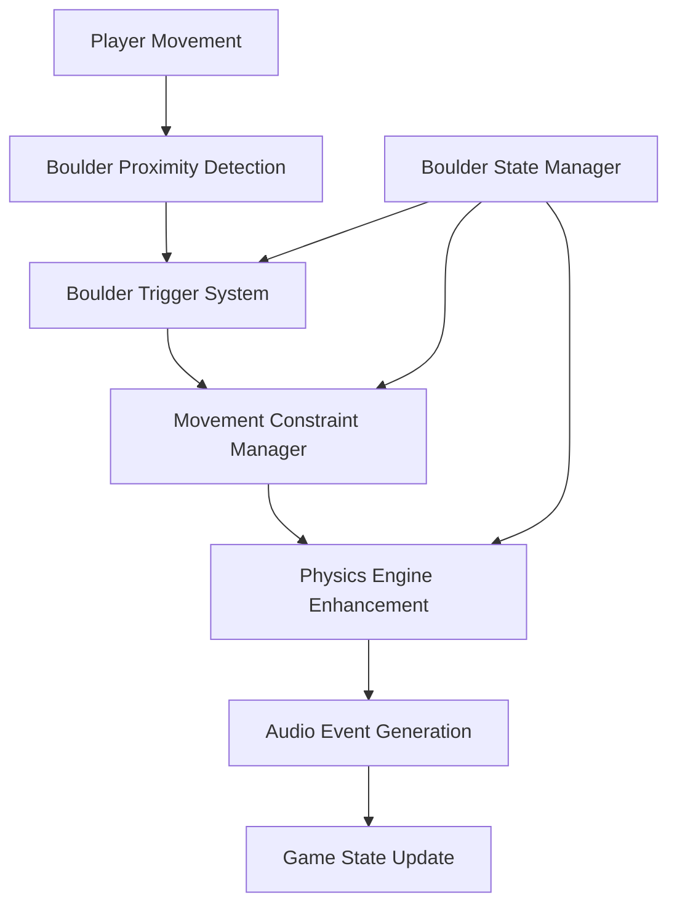

# Design Document

## Overview

The boulder behavior refinement system enhances the existing physics engine to implement proximity-based boulder triggering, player movement constraints during boulder motion, and comprehensive audio feedback. The design builds upon the current functional architecture using pure functions and immutable data structures while adding a new boulder state management layer to track triggered boulders and movement phases.

The system integrates with the existing `physics-engine.ts`, `collision-detection.ts`, and `GameState.ts` modules, extending them with proximity detection, movement constraints, and enhanced audio event generation.

## Architecture

### Core Components



### Data Flow

1. **Player Movement Phase**: Player input triggers movement validation and proximity detection
2. **Boulder Trigger Phase**: System identifies boulders adjacent to player and marks them for movement
3. **Movement Constraint Phase**: System determines if player movement should be disabled
4. **Physics Simulation Phase**: Enhanced physics engine processes boulder movement with audio events
5. **State Update Phase**: Game state is updated with new positions and movement constraints

## Components and Interfaces

### Boulder State Management

```typescript
// Enhanced boulder state tracking
interface BoulderState {
  position: Position;
  isTriggered: boolean;
  isMoving: boolean;
  triggeredOnMove: number; // Move number when triggered
}

interface BoulderStateManager {
  boulders: Map<string, BoulderState>;
  movingBoulderCount: number;
  lastPlayerPosition: Position | null;
}

// Boulder proximity detection
interface ProximityResult {
  adjacentBoulders: Position[];
  newlyTriggeredBoulders: Position[];
}
```

### Enhanced Physics Engine

```typescript
// Extended physics simulation result
interface EnhancedPhysicsResult extends PhysicsSimulationResult {
  movingBoulders: Position[];
  completedBoulders: Position[];
  playerCollisions: Position[];
}

// Boulder movement constraint
interface MovementConstraint {
  isPlayerMovementBlocked: boolean;
  blockingReason: 'boulder_movement' | 'none';
  estimatedDuration?: number;
}
```

### Audio Event Extensions

```typescript
// Enhanced sound events for boulder behavior
interface BoulderSoundEvent extends SoundEvent {
  boulderPosition?: Position;
  collisionTarget?: MazeCell;
  isPlayerDeath?: boolean;
}
```

## Data Models

### Boulder State Tracking

The system maintains a `BoulderStateManager` that tracks:
- **Boulder Positions**: Current location of each boulder
- **Trigger Status**: Whether each boulder is marked for movement
- **Movement Status**: Whether each boulder is currently moving
- **Trigger History**: Which move triggered each boulder

### Proximity Detection Model

```typescript
interface ProximityDetection {
  // Check if player is adjacent to any boulders
  detectAdjacentBoulders(
    playerPosition: Position, 
    boulderPositions: Position[]
  ): Position[];
  
  // Determine newly triggered boulders based on player movement
  identifyTriggeredBoulders(
    previousPlayerPosition: Position | null,
    currentPlayerPosition: Position,
    boulderStates: Map<string, BoulderState>
  ): Position[];
}
```

### Movement Constraint Model

```typescript
interface MovementConstraintSystem {
  // Check if player movement should be blocked
  shouldBlockPlayerMovement(boulderStateManager: BoulderStateManager): boolean;
  
  // Update movement constraints based on boulder states
  updateMovementConstraints(
    boulderStateManager: BoulderStateManager
  ): MovementConstraint;
}
```

## Error Handling

### Boulder State Consistency

- **Invalid Boulder Positions**: System validates boulder positions against maze boundaries
- **State Synchronization**: Boulder state manager maintains consistency with maze state
- **Concurrent Movement**: System handles multiple boulders moving simultaneously without conflicts

### Physics Simulation Errors

- **Infinite Movement Loops**: Maximum iteration limits prevent endless boulder movement
- **Collision Detection Failures**: Fallback collision detection ensures boulders stop appropriately
- **Audio Event Overflow**: Rate limiting prevents excessive sound event generation

### Player Movement Constraints

- **Constraint State Recovery**: System recovers from invalid constraint states
- **Input Buffer Management**: Player inputs during blocked periods are handled gracefully
- **State Transition Errors**: Robust state machine prevents invalid movement constraint transitions

## Testing Strategy

### Unit Testing

1. **Boulder Proximity Detection Tests**
   - Test adjacent boulder identification
   - Test trigger condition validation
   - Test edge cases (corners, boundaries)

2. **Movement Constraint Tests**
   - Test player movement blocking during boulder motion
   - Test constraint release when boulders stop
   - Test multiple boulder scenarios

3. **Enhanced Physics Tests**
   - Test boulder movement with audio events
   - Test collision detection with all object types
   - Test player death scenarios

### Integration Testing

1. **Game State Integration**
   - Test boulder system integration with existing game loop
   - Test audio event generation and emission
   - Test state persistence across moves

2. **Performance Testing**
   - Test system performance with multiple moving boulders
   - Test memory usage of boulder state management
   - Test audio event processing efficiency

### End-to-End Testing

1. **Player Experience Tests**
   - Test complete boulder trigger-to-collision scenarios
   - Test audio feedback timing and quality
   - Test player death and game over scenarios

2. **Edge Case Testing**
   - Test boulder behavior at maze boundaries
   - Test simultaneous boulder and player movements
   - Test complex collision scenarios

## Implementation Phases

### Phase 1: Boulder State Management
- Implement `BoulderStateManager` class
- Add proximity detection functions
- Create boulder state tracking utilities

### Phase 2: Movement Constraints
- Implement movement constraint system
- Integrate with existing player movement logic
- Add constraint state management

### Phase 3: Enhanced Physics Engine
- Extend physics engine with boulder triggering
- Implement enhanced collision detection
- Add comprehensive audio event generation

### Phase 4: Integration and Testing
- Integrate all components with existing game state
- Implement comprehensive test suite
- Performance optimization and debugging

## Performance Considerations

### Optimization Strategies

- **Spatial Indexing**: Use efficient data structures for proximity detection
- **State Caching**: Cache boulder states to minimize recalculation
- **Event Batching**: Batch audio events to reduce processing overhead
- **Lazy Evaluation**: Only process boulder states when necessary

### Memory Management

- **State Cleanup**: Remove completed boulder states to prevent memory leaks
- **Event Pool**: Reuse audio event objects to reduce garbage collection
- **Maze State Sharing**: Share immutable maze state between components

### Scalability

- **Multiple Boulders**: System designed to handle numerous simultaneous boulder movements
- **Large Mazes**: Efficient algorithms scale with maze size
- **Extended Gameplay**: State management supports long gameplay sessions