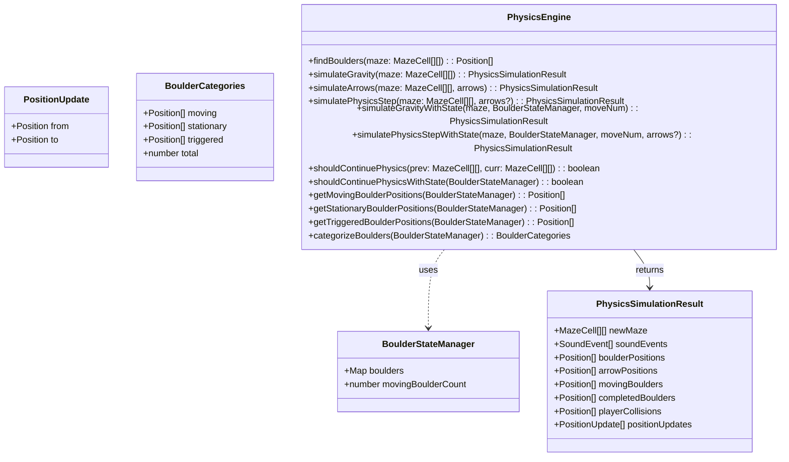
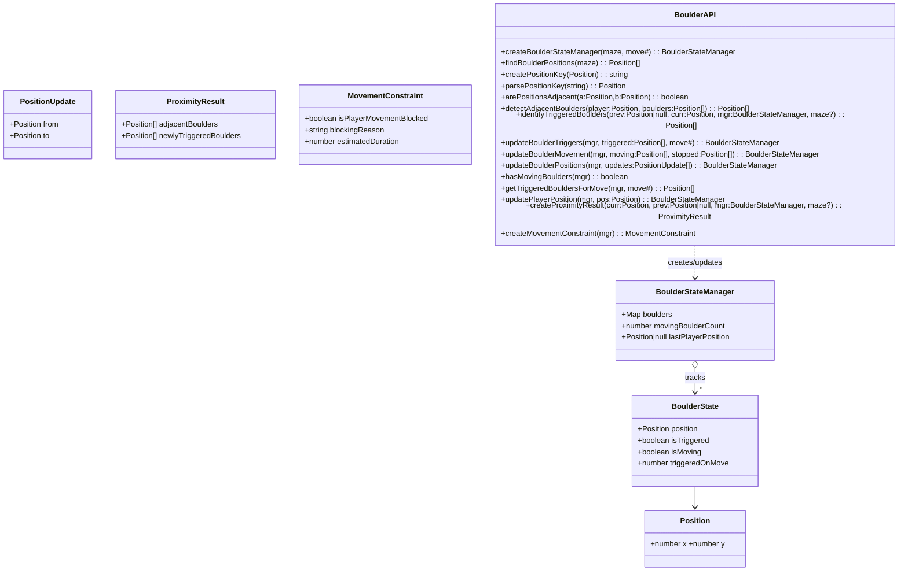

# Fix parse error in mermaid file
_Exported on 8/9/2025 at 16:13:39 GMT+10 from Cursor (1.4.3)_

---

**User**

The mermaid file physics-engine-class.mmd has the error Parse error on line 10:
...ayerCollisions    +{from:Position,to:Po
----------------------^
Expecting 'STRUCT_STOP', 'MEMBER', got 'OPEN_IN_STRUCT' can you fix it?

---

**Cursor**

Scanning the Mermaid diagram file to locate and fix the invalid inline struct syntax, and cross-checking another class diagram for consistent style.

I’m going to update the Mermaid class diagram to replace the inline object type with a named class, and also fix the return type that used an inline struct. This should resolve the parse error and keep the diagram expressive.



Fixed. Mermaid doesn’t allow inline object types in class members/returns. I replaced them with named classes and updated references.

- In `Instructions/Mermaid Diagrams/physics-engine-class.mmd`:
  - Added `PositionUpdate` and `BoulderCategories` classes.
  - Changed `positionUpdates` to `PositionUpdate[]`.
  - Changed `categorizeBoulders(...)` return type to `BoulderCategories`.

If you render other diagrams, note that `boulder-state-manager-class.mmd` still uses inline object types in method params/returns (e.g., `updates:{from:Position,to:Position}[]`, `{adjacentBoulders,...}`, `{isPlayerMovementBlocked,...}`) which can also trip the parser. I can normalize those too if you want.

- Changes: `physics-engine-class.mmd` now defines `PositionUpdate`, `BoulderCategories`; removed inline struct usage.

---

**User**

The mermaid file boulder-state-manager-class.mmd has this error Parse error on line 24:
...itions(mgr, updates:{from:Position,to:Po
-----------------------^
Expecting 'STRUCT_STOP', 'MEMBER', got 'OPEN_IN_STRUCT' can you fix and update the file please?

---

**Cursor**

Updating the diagram to remove inline object types by introducing named classes and adjusting method signatures accordingly.



I’m going to quickly re-open the updated diagram to verify no other inline struct syntax remains and that class references are consistent across both diagrams.

Made the diagram valid by removing inline object types and introducing named classes; updated signatures accordingly.

```35:43:Instructions/Mermaid Diagrams/boulder-state-manager-class.mmd
  class BoulderAPI {
    +createBoulderStateManager(maze, move#): BoulderStateManager
    +findBoulderPositions(maze): Position[]
    +createPositionKey(Position): string
    +parsePositionKey(string): Position
    +arePositionsAdjacent(a:Position,b:Position): boolean
    +detectAdjacentBoulders(player:Position, boulders:Position[]): Position[]
    +identifyTriggeredBoulders(prev:Position|null, curr:Position, mgr:BoulderStateManager, maze?): Position[]
    +updateBoulderTriggers(mgr, triggered:Position[], move#): BoulderStateManager
    +updateBoulderMovement(mgr, moving:Position[], stopped:Position[]): BoulderStateManager
    +updateBoulderPositions(mgr, updates:PositionUpdate[]): BoulderStateManager
    +hasMovingBoulders(mgr): boolean
    +getTriggeredBouldersForMove(mgr, move#): Position[]
    +updatePlayerPosition(mgr, pos:Position): BoulderStateManager
    +createProximityResult(curr:Position, prev:Position|null, mgr:BoulderStateManager, maze?): ProximityResult
    +createMovementConstraint(mgr): MovementConstraint
  }
```

```2:15:Instructions/Mermaid Diagrams/boulder-state-manager-class.mmd
  class PositionUpdate {
    +Position from
    +Position to
  }
  class ProximityResult {
    +Position[] adjacentBoulders
    +Position[] newlyTriggeredBoulders
  }
  class MovementConstraint {
    +boolean isPlayerMovementBlocked
    +string blockingReason
    +number estimatedDuration
  }
```

Status: Updated `boulder-state-manager-class.mmd`, removed the offending `updates:{from:Position,to:Position}[]` and other inline structs; replaced with `PositionUpdate`, `ProximityResult`, `MovementConstraint`. Should render cleanly now.

- Edits: Replaced inline structs in method params/returns with named classes; added those classes at top.

```plaintext
  class BoulderAPI {
    +createBoulderStateManager(maze, move#): BoulderStateManager
    +findBoulderPositions(maze): Position[]
    +createPositionKey(Position): string
    +parsePositionKey(string): Position
    +arePositionsAdjacent(a:Position,b:Position): boolean
    +detectAdjacentBoulders(player:Position, boulders:Position[]): Position[]
    +identifyTriggeredBoulders(prev:Position|null, curr:Position, mgr:BoulderStateManager, maze?): Position[]
    +updateBoulderTriggers(mgr, triggered:Position[], move#): BoulderStateManager
    +updateBoulderMovement(mgr, moving:Position[], stopped:Position[]): BoulderStateManager
    +updateBoulderPositions(mgr, updates:PositionUpdate[]): BoulderStateManager
    +hasMovingBoulders(mgr): boolean
    +getTriggeredBouldersForMove(mgr, move#): Position[]
    +updatePlayerPosition(mgr, pos:Position): BoulderStateManager
    +createProximityResult(curr:Position, prev:Position|null, mgr:BoulderStateManager, maze?): ProximityResult
    +createMovementConstraint(mgr): MovementConstraint
  }
```

```plaintext
  class PositionUpdate {
    +Position from
    +Position to
  }
  class ProximityResult {
    +Position[] adjacentBoulders
    +Position[] newlyTriggeredBoulders
  }
  class MovementConstraint {
    +boolean isPlayerMovementBlocked
    +string blockingReason
    +number estimatedDuration
  }
```

