# Diagrams

## Architecture

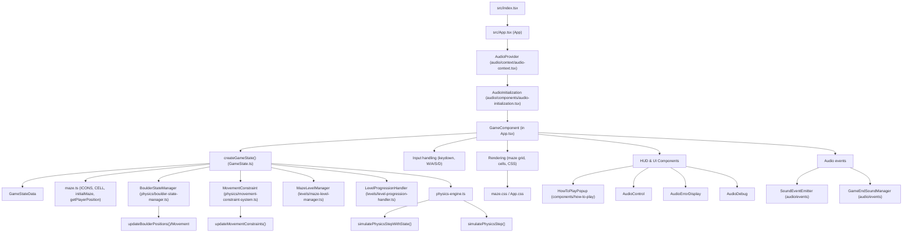

## UI-Layout

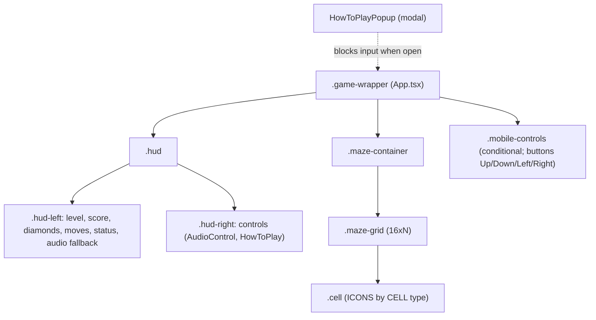

## Update Flow

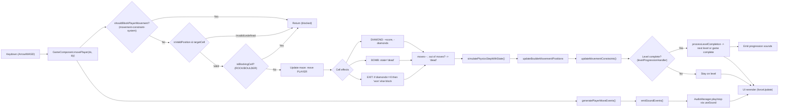

## Game State Model

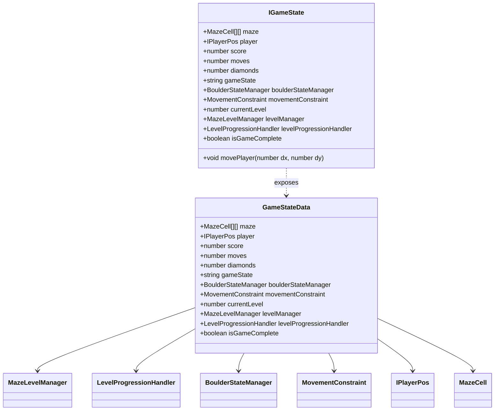

## Maze Level Manager Class

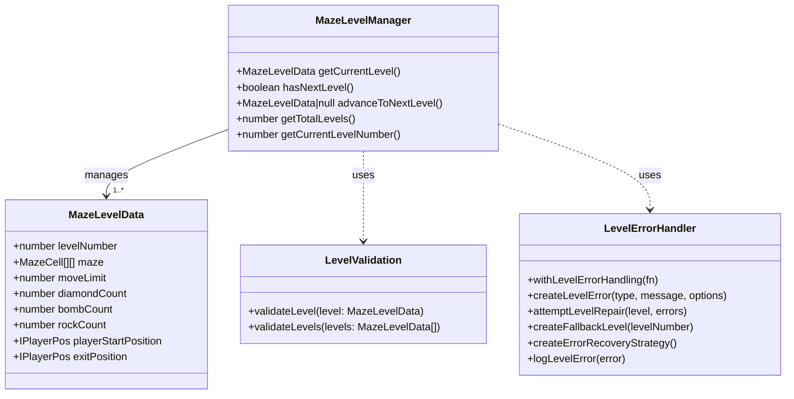

## Maze Level Manager Sequence

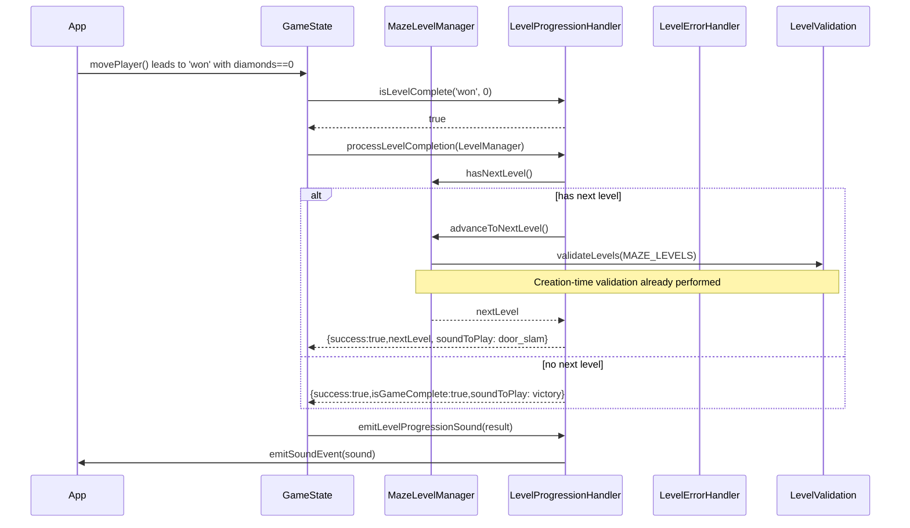

## Audio Sub-System

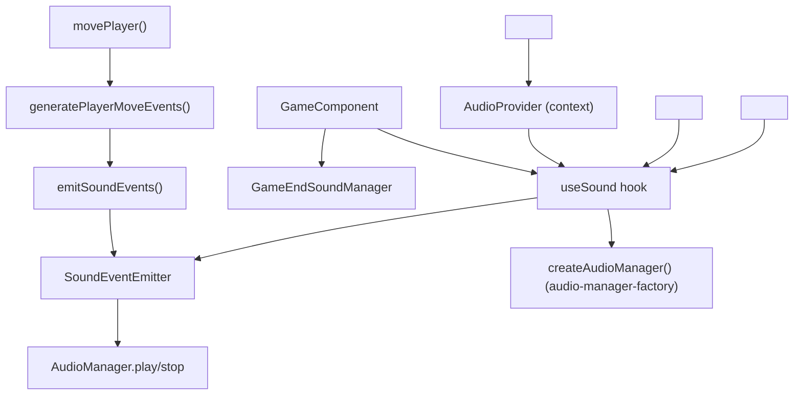

## Physics Engine Class

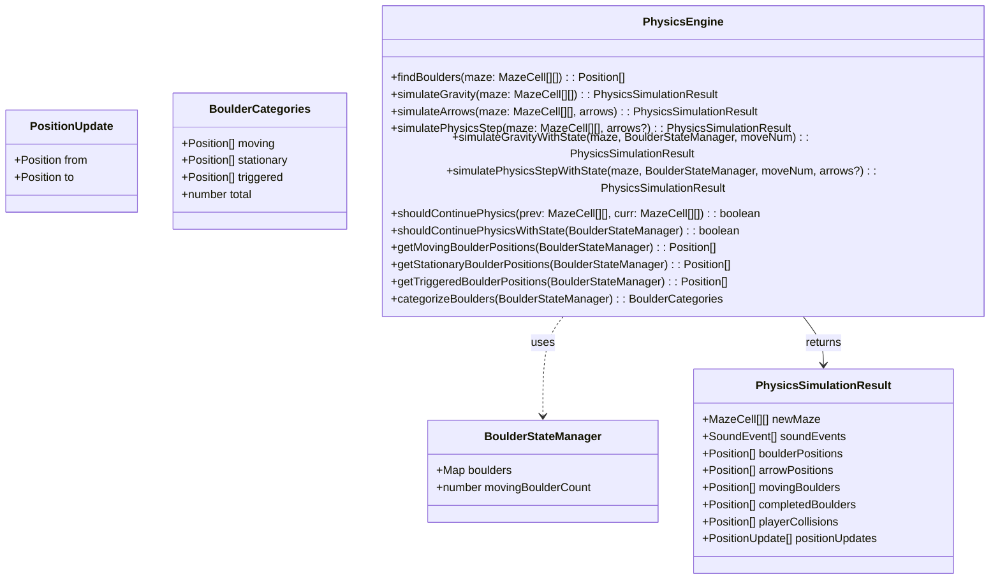

## Physics Engine Sequence

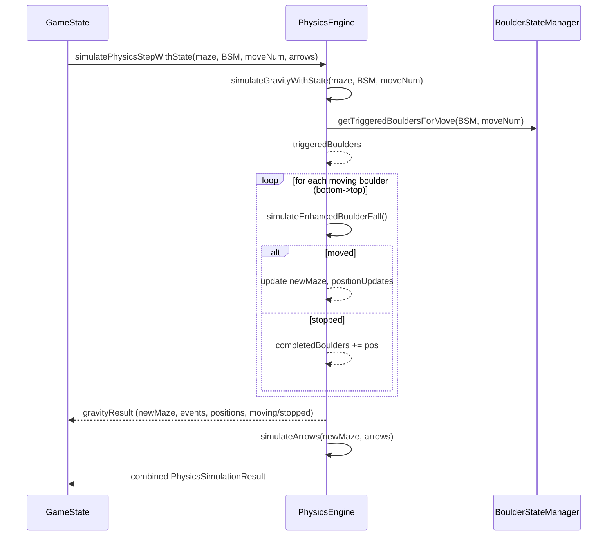

## Boulder State Manager Class

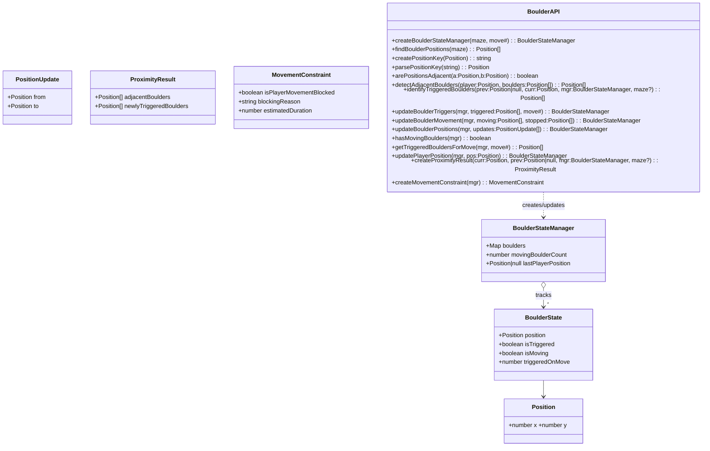

## Boulder State Manager Sequence

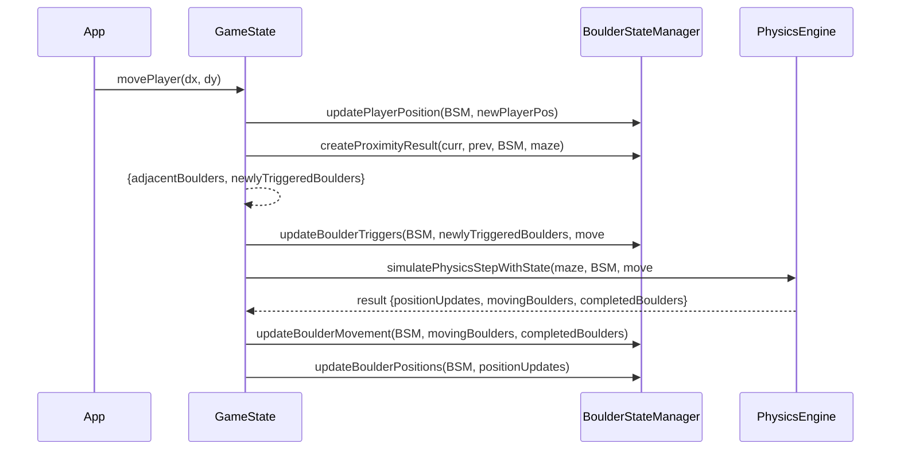
